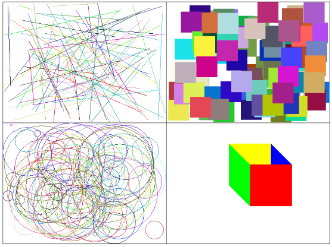

# 5.2 RandomGraphics

For this lab assignment, you will create a grid with two rows and two columns. Each cell in the grid will contain a specific type of graphics object. You will use Math.Random() and AWT library to generate random shapes and colors within the grid cells.

**Objective**: 
Your task is to randomly generate graphics objects (lines, squares, and circles) that fit within the boundaries of the individual grid cells. You will receive partial credit if only some of the cells are correctly filled with shapes, and full credit if all cells are populated as required.

#### **Grid Layout**
- The grid is 2 rows by 2 columns (four cells in total).
- The grid is divided into cells, and each shape (line, square, circle) must stay within the cell boundaries.
- You will lose points if the objects extend outside of their designated cells.

---

### **Starter Code**

Here is the basic structure for the grid. You can expand on it to complete the assignment.

#### **Starter Code: RandomGraphics.java**

```java
import java.awt.*;
import java.util.*;

public class RandomGraphics {
    private int x;
    private int y;
    private int width;
    private int height;

    public RandomGraphics(int x, int y, int w, int h){
        this.x = x;
        this.y = y;
        this.width = w;
        this.height = h;
    }

    // Draws the 2x2 grid
    public void drawGrid(Graphics g){
        g.drawRect(x, y, width, height);
        g.drawLine(x + width / 2, y, x + width / 2, y + height); // Vertical line
        g.drawLine(x, y + height / 2, x + width, y + height / 2); // Horizontal line
    }
}
```


---

### **70, 80, 90 & 100 Point Versions**

#### **70-Point Version**: 
- Display **one** of the four cells with random graphics objects.

#### **80-Point Version**: 
- Display **two** cells with random graphics objects.

#### **90-Point Version**: 
- Display **three** cells with random graphics objects.

#### **100-Point Version**: 
- Display **all four** cells, each with a specific random object or pattern.

---

### **Cell Descriptions**

#### **Cell 1: Random Lines**
- Draw **100 random lines** in one cell.
- Both ends of each line should have random `(x, y)` coordinates within the cell.
- Each line should be drawn in a random color.

#### **Cell 2: Random Squares**
- Draw **100 random squares** in another cell.
- Each square must be entirely within the cell and have a fixed size of **50x50 pixels**.
- The position of each square should be random, and the color of each square should also be randomly generated.

#### **Cell 3: Random Circles**
- Draw **100 random circles** in another cell.
- Each circle's diameter should range between **0 and 200 pixels**, and the circles must fit entirely within the cell.
- The color of each circle should be random, generated by using random values for red, green, and blue between 0 and 255.

#### **Cell 4: Polygon Box (No Randomness)**
- In the final cell, draw a box using the `Polygon` class.
- The box should be colored using predefined colors: **red, green, yellow, and blue**.

---

### **Random Color Generation**

To generate a random color, use the `Math.random()` to produce three random values between 0 and 255 for the red, green, and blue components of the color. 


---

### **Requirements for 100 Points**

- Ensure that **all four cells** display their respective objects (lines, squares, circles, and polygon box).
- **Randomness** should be applied to the size, location, and color of lines, squares, and circles.
- **No random behavior** for the polygon box in the final cell.

#### **Expected Output:**

1. One cell filled with **randomly colored lines**.
2. Another cell filled with **randomly positioned, colored squares**.
3. Another cell filled with **randomly sized, positioned, and colored circles**.
4. One cell displaying a **non-random box** with predefined colors.

---

### **Grading Criteria**

- **70 Points**: One cell is correctly filled with random graphics objects.
- **80 Points**: Two cells are filled with random graphics objects.
- **90 Points**: Three cells are filled with random graphics objects.
- **100 Points**: All four cells are filled with their respective graphics objects, and all randomness behaves correctly.

